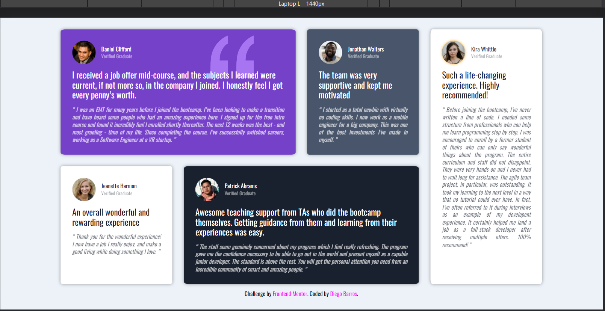
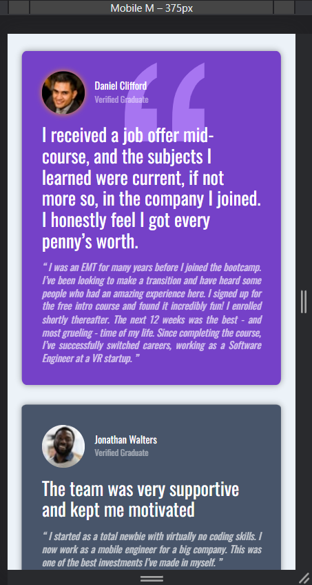

# Frontend Mentor - Testimonials grid section solution

This is a solution to the [Testimonials grid section challenge on Frontend Mentor](https://diegoibh.github.io/css-grid-project/). Frontend Mentor challenges help you improve your coding skills by building realistic projects. 

## Table of contents

- [Overview](#overview)
  - [The challenge](#the-challenge)
  - [Screenshot](#screenshot)
  - [Links](#links)
- [My process](#my-process)
  - [Built with](#built-with)
  - [What I learned](#what-i-learned)
  - [Continued development](#continued-development)
  - [Useful resources](#useful-resources)
- [Author](#author)
- [Acknowledgments](#acknowledgments)

**Note: Delete this note and update the table of contents based on what sections you keep.**

## Overview

### The challenge

Users should be able to:

- View the optimal layout for the site depending on their device's screen size

### Screenshot





### Links

- Solution URL: [Add solution URL here](https://diegoibh.github.io/css-grid-project/)
- Live Site URL: [Add live site URL here](https://diegoibh.github.io/css-grid-project/)

## My process

### Built with

- Semantic HTML5 markup
- CSS custom properties
- Flexbox
- CSS Grid
- Mobile-first workflow

### What I learned

I managed to spend more time in optimizing code for general purposes which is normally hard for me to see or put time in (all though I would like to hear opinons on how my code might be to extensive or confusing).

Also, to give more general mesure units for margin, padding and font-size... which in return makes it easier to adjust to screen on different sizes by increasing :root font-size.

Below some simple animation to give more attention to the image of the testimonials:

```css
.student-img{
    border-radius: 50%;
    border: 3px 
}
.container:hover .student-img{
    animation: pulse 2s infinite;
    animation-timing-function: ease-in-out;
}
@keyframes pulse{
    0%{box-shadow:0 0 4px orange}
    25%{box-shadow:0 0 6px orange}
    50%{box-shadow:0 0 10px orange}
    75%{box-shadow:0 0 6px orange}
    100%{box-shadow:0 0 4px orange}
}
```

### Continued development

I am still figuring out how line-height works with for different font sizes or headers

Optimizing code (less lines equal result)

Having a better understanding on design and animation.


### Useful resources

- [Youtube Channel of Traversy](https://www.youtube.com/c/TraversyMedia) - Great with specific crash courses or topics that you would like to get in to, as for this case, was CSS Grid.
- [W3Schools web site](https://www.w3schools.com/) - Good for reminders on code and concepts, as a refresher.

## Author

- Website - [Add your name here](https://github.com/DiegoIBH)
- Frontend Mentor - [@Diego Barros](https://www.frontendmentor.io/profile/yourusername)
- Twitter - [@ibhDiego]
